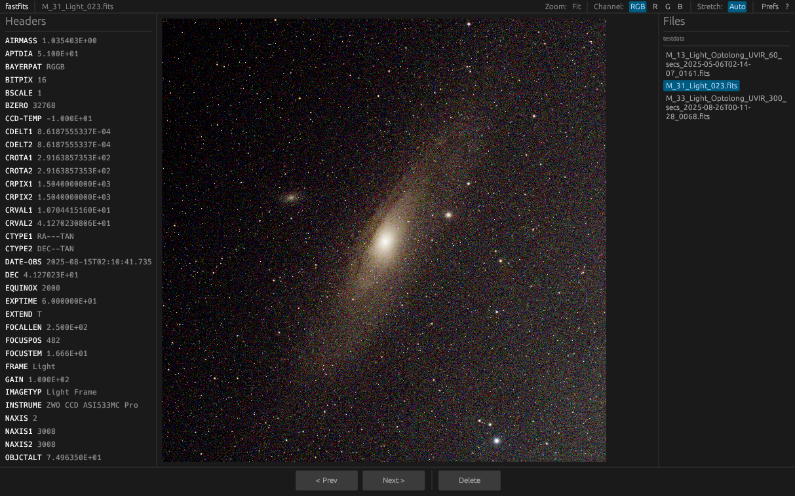

# fastfits

A fast desktop viewer for [FITS](https://fits.gsfc.nasa.gov/) astronomy image files, built with Rust and [egui](https://github.com/emilk/egui).



## Features

- **File browser** — lists all `.fits` / `.fit` / `.fz` files in the current directory; click or use arrow keys to navigate
- **Image rendering** — autostretch (histogram-based MTF, similar to Siril/KStars) and linear (min/max) stretch modes
- **Multi-channel support** — composite RGB view or individual R/G/B channel views for colour images; single-channel for mono
- **Bayer debayering** — RGGB Bayer-patterned single-plane FITS files are automatically demosaiced; choose Cubic or Bilinear algorithm via **Preferences** (`,`)
- **Zoom** — fit-to-window (default), zoom in/out, or 1:1 pixel view; scroll when zoomed in
- **FITS header inspector** — left panel shows all header key/value pairs alphabetically
- **File deletion** — move the current file to the system trash (with fallback to permanent delete); auto-advances to the next file
- **Keyboard-driven** — every action has a keyboard shortcut (press `?` for the full list)

## Keyboard shortcuts

| Key | Action |
|---|---|
| `←` / `↑` | Previous file |
| `→` / `↓` | Next file |
| `Delete` | Move current file to trash |
| `S` | Toggle stretch mode (Auto ↔ Linear) |
| `+` / `-` | Zoom in / out |
| `0` | Zoom to 1:1 (100%) |
| `F` | Zoom to fit |
| `?` | Show / hide keyboard shortcuts |
| `,` | Show / hide Preferences |
| `Escape` | Close help / preferences popup |

## Building

### System dependency

`libcfitsio` must be installed before building:

```bash
# Debian / Ubuntu
sudo apt install libcfitsio-dev

# Fedora / RHEL
sudo dnf install cfitsio-devel

# Arch
sudo pacman -S cfitsio
```

### Compile and run

```bash
# Debug build
cargo build

# Release build (recommended for performance)
cargo build --release

# Run directly
cargo run --release -- path/to/file.fits
cargo run --release -- path/to/directory/
cargo run --release            # defaults to current directory
```

The compiled binary is at `target/release/fastfits`.

## Usage

```
fastfits [PATH]
```

`PATH` can be:
- a single `.fits` / `.fit` / `.fz` file — opens that file and browses its directory
- a directory — opens the first FITS file found in that directory
- omitted — defaults to the current working directory
