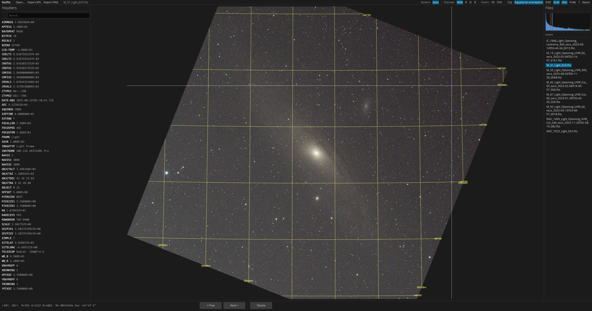

# fastfits

A fast desktop viewer for [FITS](https://fits.gsfc.nasa.gov/) astronomy image files, built with Rust and [egui](https://github.com/emilk/egui).



## Features

- **File browser** — lists all `.fits` / `.fit` / `.fz` files in the current directory; click or use arrow keys to navigate; double-click subdirectories to descend into them or `..` to go to the parent directory; the full directory path is shown above the file list
- **File open dialog** — click **Open…** in the menu bar or press `Ctrl+O` to pick any FITS file via a native file dialog; the browser switches to that file's directory automatically
- **Image rendering** — autostretch (PixInsight STF algorithm: median-based sky estimation, one-sided σ noise, MTF midtone placement) and linear (min/max) stretch modes
- **Histogram panel** — per-channel histogram with R/G/B overlapping bars; AutoStretch marker lines show black point, midtone, and white point; toggle with `H`
- **Seeing estimator** — the right panel reports atmospheric seeing (FWHM of stellar PSFs) measured automatically from each image; shows arcseconds when WCS is present, pixels otherwise; colour-coded by atmospheric quality (Seeing row) and PSF sampling adequacy (FWHM row); hover either value for a full legend and algorithm description; computed in a background thread with no impact on image display
- **Multi-channel support** — composite RGB view or individual R/G/B channel views for colour images; single-channel for mono
- **Bayer debayering** — RGGB Bayer-patterned single-plane FITS files are automatically demosaiced; choose Cubic or Bilinear algorithm via **Preferences** (`,`); click **Raw** in the menu bar to bypass debayering and view the original single-channel sensor data
- **Image cache** — an LRU cache keeps up to 8 recently viewed images in memory; adjacent files are preloaded in the background, making forward/backward navigation near-instant
- **Zoom** — fit-to-window (default), zoom in/out, or 1:1 pixel view (`0` key or **1:1** button); scroll wheel zooms into the point under the cursor; drag to pan when zoomed in
- **Pixel value on hover** — floating tooltip near the cursor shows ADU value(s) and RA/Dec (when WCS is present); for Bayer images the raw sensor ADU is shown alongside the debayered R/G/B values
- **Sky markers** — right-click to place coloured circle annotations stored in equatorial coordinates (RA/Dec); they follow zoom, pan, and rotation correctly; right-click an existing marker to remove it; up to 8 per session; requires WCS headers
- **WCS coordinate grid** — press `G` to overlay a RA/Dec grid with auto-spaced lines and coordinate labels; works with TAN-projection files using `CD` matrix or `CDELT`/`CROTA2`; silently disabled for files without valid WCS
- **DSO catalogue overlay** — press `D` to overlay labelled circles for ~14 000 Deep Sky Objects from the [OpenNGC](https://github.com/mattiaverga/OpenNGC) catalogue (Messier + NGC/IC, CC-BY-SA); colour-coded by type (galaxies orange, clusters cyan/yellow, nebulae violet/teal); circles scale with zoom; silently absent without WCS
- **North-up / East-left orientation** — press `N` or click **N↑** in the menu bar to rotate the image so North is up and East is to the left (standard astronomical convention); requires WCS headers; WCS grid and DSO overlays follow the rotation correctly
- **Crosshair overlay** — semi-transparent crosshair follows the cursor over the image for precise pointing
- **FITS header inspector** — left panel shows all header key/value pairs alphabetically
- **File deletion** — move the current file to the system trash (with fallback to permanent delete); auto-advances to the next file
- **Export** — save the current stretched view as PNG or JPEG via **Export…** (`Ctrl+E`); filename defaults to `<source>_export.png`
- **Persistent settings** — stretch mode, demosaic algorithm, histogram visibility, WCS grid, DSO overlay, North-up toggle, and the last-used directory are saved automatically on exit and restored on next launch (CLI argument always takes precedence)
- **Keyboard-driven** — every action has a keyboard shortcut (press `?` for the full list)

## Keyboard shortcuts

On first launch, a welcome popup shows a short overview and the full list of shortcuts;
tick **Don't show this again** to hide it on subsequent runs. Press `?` any time to
reopen the shortcut reference.

| Key | Action |
|---|---|
| `Left` / `Up` | Previous file |
| `Right` / `Down` | Next file |
| `Mouse Back` / `Forward` | Previous / next file |
| `Home` / `End` | Jump to first / last file |
| `PageUp` / `PageDown` | Skip back / forward 10 files |
| `Delete` | Move current file to trash |
| `S` | Toggle stretch mode (Auto / Linear) |
| `+` / `-` | Zoom in / out |
| `0` | Zoom to 1:1 (100%) |
| `Ctrl+O` | Open file dialog |
| `Ctrl+E` | Export current view as PNG / JPEG |
| `F` | Zoom to fit (resets pan) |
| `Scroll` | Zoom in/out centred on cursor |
| `H` | Show / hide histogram |
| `G` | Show / hide WCS coordinate grid |
| `D` | Show / hide DSO catalogue overlay |
| `C` | Show / hide clipping overlay (overexposed pixels in red) |
| `R` | Show / hide raw Bayer sensor data (Bayer images only) |
| `N` | Rotate image: North up, East left (requires WCS) |
| `A` | Show / hide About |
| `?` | Show / hide keyboard shortcuts |
| `,` | Show / hide Preferences |
| `Escape` | Close help / preferences popup |
| `Q` | Quit |

## Building

### System dependency

`libcfitsio` must be installed before building:

```bash
# Debian / Ubuntu
sudo apt install libcfitsio-dev

# Fedora / RHEL
sudo dnf install cfitsio-devel

# Arch
sudo pacman -S cfitsio
```

### Compile and run

```bash
# Debug build
cargo build

# Release build (recommended for performance)
cargo build --release

# Run directly
cargo run --release -- path/to/file.fits
cargo run --release -- path/to/directory/
cargo run --release            # defaults to current directory
```

The compiled binary is at `target/release/fastfits`.

## Pre-built binaries

Every tagged release publishes pre-built binaries on the [GitHub Releases](https://github.com/praetp/fastfits/releases) page:

| Platform | File |
|---|---|
| Linux x86-64 | `fastfits-linux-x86_64` |
| Linux arm64 | `fastfits-linux-arm64` |
| Windows x86-64 | `fastfits-windows-x86_64.exe` |
| macOS arm64 (Apple Silicon) | `fastfits-macos-arm64.dmg` |

No `libcfitsio` installation required — everything is statically linked.

**Linux / Windows:** make the binary executable (`chmod +x` on Linux) and run it directly.

**macOS:** double-click the `.dmg`, drag `fastfits.app` to `/Applications`. On first launch macOS will block the app because it isn't signed by an Apple Developer (*"cannot be opened because the developer cannot be verified"*). To allow it: right-click `fastfits.app` → **Open** → confirm once. Subsequent launches work normally.

## Usage

```
fastfits [PATH]
```

`PATH` can be:
- a single `.fits` / `.fit` / `.fz` file — opens that file and browses its directory
- a directory — opens the first FITS file found in that directory
- omitted — defaults to the current working directory

## Attribution

The DSO catalogue overlay uses data from [OpenNGC](https://github.com/mattiaverga/OpenNGC) by Mattia Verga, licensed under [CC-BY-SA 4.0](https://creativecommons.org/licenses/by-sa/4.0/).
